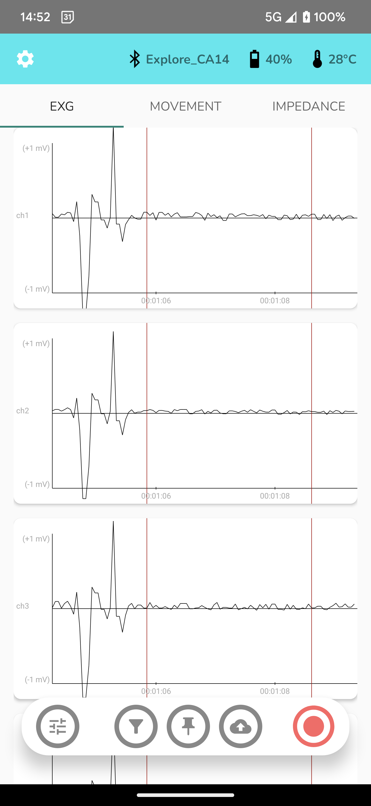

# Explore Android App V0.1
## Installation
To install the app, simply download explore-android.apk on your phone and tap the file to start the installation process.
## Usage
To use the app, you can connect to a device by tapping the Bluetooth icon in the start screen. Devices have to be paired via the phone's Bluetooth settings before they will show up in the app's device list. If you are using Android 12 or up, you will be asked to allow the app to find, connect and determine the relative position of nearby devices on first startup. Devices cannot be connected if this isn't allowed. If you clicked away the prompt accidentally and it doesn't reappear, you can either reinstall the app or manually give the app the required permission in the app settings of your phone (Settings -> Apps -> Mentalab Explore -> Permissions -> Nearby devices).

Once connected, you will be greeted by the app's main screen and see all of your device's channels as a scrollable view. If you are using a 32 channel device, you can choose to view channels 1-8, 9-16, 17-24 or 25-32 by using the buttons at the top of the charts. You can view basic device information (device name, battery status and device temperature) at the top of the app.

You can navigate to and from the movement plots (gyroscope, accelerometer and magnetometer) and the impedance visualisation by swiping or tapping tapping the respective tab ("EXG", "MOVEMENT", "IMPEDANCE").

The bottom tray allows you to quickly change the y-scale of the EXG plots (left-most button), set markers in the visualisation (pin button in the middle) and to start recording to .csv (right-most button). To close the pop-up that lets you change the y-scale, tap the same button again.

Recordings are saved to the "Downloads" folder and will have the starting time as part of the filename. To stop a recording, simply tap the right-most button again.

Please note that navigating to the impedance tab while recording will stop the recording and deactivate the record button until you navigate back to "EXG" or "MOVEMENT".

You can change device settings by going to the app settings (cogwheel button in the upper left corner). Here you can format the memory of the connected device, soft reset it or change its sampling rate. To change the sampling rate, make sure to tap "APPLY" before navigating back to the main app screen. You can also disconnect or connect from here.

## Known issues
There may be Bluetooth issues and random disconnects on some phones.
Phones and Android versions that are tested and work:
| Device | Android version |
| ----------- | ----------- |
| Pixel 7 Pro | Android 13 |
| Pixel 6 | Android 13 |

Sending commands to the device (format, reset, change sampling rate) can lead to connection loss and unexpected behaviour and may require restarting the app.